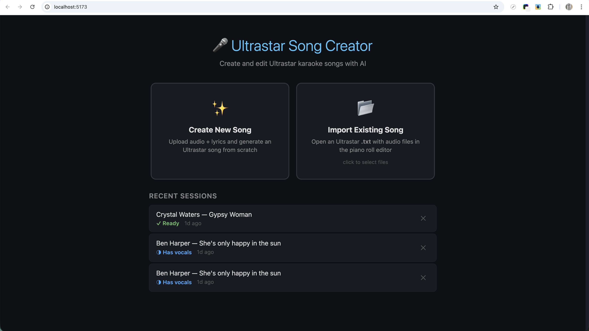
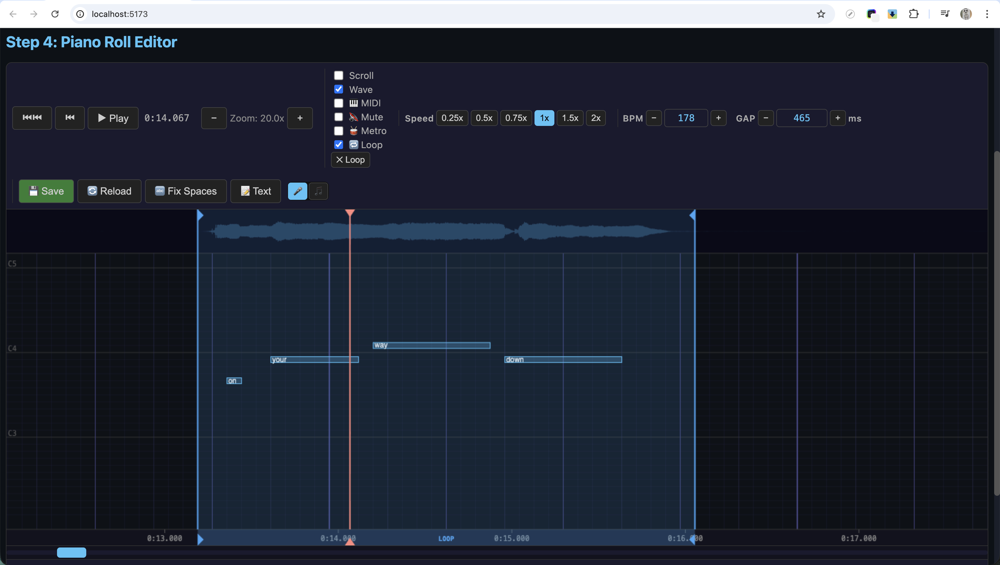

# Ultrastar Creator Tool

<p align="center">
  
</p>

> **Latest release: v4.1.0** — Freestyle note support, editor bug fixes, and [97 supported languages](#supported-languages) for lyrics & Ultrastar song generation. See [Changelog](#changelog) below.

A tool to create **Ultrastar karaoke songs** with the help of AI. It guides you through 4 steps — from uploading audio to exporting a ready-to-play Ultrastar .txt file — using automatic vocal separation, pitch detection, and lyrics alignment to do the heavy lifting, while you fine-tune the result in a built-in piano roll editor.

**Goal**: Make it easy for anyone to create Ultrastar songs, so more people sing together. 🎤

## Download

> **Early access — not yet code-signed.** See instructions below to open it on macOS.

| Platform | Status | Link |
|----------|--------|------|
| macOS (Apple Silicon / ARM) | ✅ Available | [Google Drive](https://drive.google.com/drive/folders/1sFrLy6YNSMU56L0XAZ8I3tmb6WcEh1Oc?usp=sharing) |
| macOS (Intel x86) | ✅ Available | [Google Drive](https://drive.google.com/drive/folders/1sFrLy6YNSMU56L0XAZ8I3tmb6WcEh1Oc?usp=sharing) |
| Windows | ✅ Available | [Google Drive](https://drive.google.com/drive/u/0/folders/1ZYr0LAnmvewVIIbvbDlu5pK6F9XCBxjr) |
| Linux | 🔜 Coming soon | Same folder above |

### Opening on macOS (Gatekeeper bypass)

Because the app is not yet code-signed, macOS will block it on first launch. To open it:

1. Double-click the `.dmg` and drag **UltrastarCreatorTool** to your Applications folder.
2. Try to open it — macOS will show a *"cannot be opened because the developer cannot be verified"* message. Click **Cancel**.
3. Go to **System Settings → Privacy & Security**, scroll down, and click **Open Anyway** next to the UltrastarCreatorTool entry.
4. Confirm by clicking **Open** in the dialog that appears.

You only need to do this once.

### Upgrading from v3.1.0 or earlier to v4.0.0

> ⚠️ **If you are upgrading from v3.1.0 or an older version**, follow these steps before installing:

1. **Close the app.** Since v3.1.0 the backend is killed automatically when the window closes. If you are on an older version (v3.0.x or below), the backend may still be running — kill it manually:
   - **macOS:** `pkill -f backend`
   - **Windows:** `taskkill /IM backend.exe /F`
2. **Uninstall the old app first** before installing the new version.
   - macOS: drag **UltrastarCreatorTool** out of Applications to Trash, then empty Trash.
   - Windows: uninstall via Settings → Apps before running the new installer.
3. **Sessions from v3.0.x or earlier** may have compatibility issues. Export your songs as ZIP before upgrading if you want to be safe.

Sessions created in **v3.1.0** should be compatible with v4.0.0

### Troubleshooting / Debug Logs

If something goes wrong inside the app, you can view the backend log in real time:

```bash
tail -f ~/Library/Logs/com.ultrastar.creator/backend.log
```

This shows all processing steps — vocal separation progress, transcription, pitch detection, and any errors.

## How it Works

| Step | What you do | What the tool does |
|------|-------------|-------------------|
| **1. Upload** | Upload a song (full mix or vocals-only) | Optionally separates vocals using Demucs |
| **2. Lyrics & Generate** | Review/edit lyrics, then click "Generate" | Auto-hyphenates syllables, detects BPM, analyzes pitch, aligns syllables to audio, produces Ultrastar file |
| **3. Editor** | Review and adjust notes in the piano roll | Shows waveform, plays MIDI pitches, supports grid snap, BPM calibration |
| **4. Export** | Add cover/background art, video info, download your files | Exports ZIP with Ultrastar .txt (including asset headers), MIDI, images, and audio |

## Video Tutorials

| Overview — Getting Started | Pitch Line, Vocal Tracing & Sing Along |
|:--------------------------:|:--------------------------------------:|
| [](https://www.youtube.com/watch?v=zKw03mhrYX8&t=5s) | [](https://www.youtube.com/watch?v=p4ihQaDhwfg) |

| Looping & Scrubbing | BPM & Metronome |
|:-------------------:|:---------------:|
| [](https://www.youtube.com/watch?v=WwAZQlhqSwE&t=2s) | [](https://www.youtube.com/watch?v=L8jnov5M-XY) |

## Screenshots

### Home — Project Launcher


### Step 1 — Upload Audio & Extract Vocals


### Step 2 — Edit Lyrics & Generate Ultrastar File


### Step 3 — Piano Roll Editor





### Step 4 — Export Files


## Features

### AI Pipeline
- **Vocal separation** (Demucs v4) — isolates vocals from full mix
- **Pitch detection** (PYIN) — robust pitch tracking via librosa
- **Forced alignment** (WhisperX) — syllable-level timing with ~50ms median accuracy, energy-based fallback
- **BPM detection** — automatic tempo analysis with beat-phase alignment
- **Onset snapping** — refines syllable boundaries using spectral onsets
- **One-click generation** — audio → Ultrastar format in minutes

### Piano Roll Editor
- **Full note editing** — move, resize, split, merge, delete notes
- **Golden/Rap note types** — visual indicators (★ gold, orange rap)
- **Grid alignment** (Ctrl+B) — snap the entire beat grid to match the audio
- **GAP adjustment** (Ctrl+G) — click any grid line to set the GAP position
- **BPM tapper** — tap the beat in a modal (click or press Enter) to measure BPM; shows live BPM with apply buttons for 1×–8× multipliers; play/pause and jump-to-GAP controls included; metronome muted while tapper is open
- **Text editor** — edit raw Ultrastar content with live preview
- **Session notes** — jot down reminders while editing; saved automatically per session and restored next time you open the editor
- **Flag markers** — place green marker lines anywhere on the canvas (right-click → Add Flag); drag, nudge ±1 beat, or delete via right-click; shown as green ticks on the scrollbar; persisted per session
- **Custom scrollbar** — fully custom div-based slider; the handle tracks the canvas center beat so zooming in/out never moves it; playhead and flag ticks align perfectly with no browser-offset math
- **Select all** (Ctrl+A) — select all notes for bulk move
- **Undo/Redo** — full snapshot history (notes, BPM, GAP, downbeat offset, headers)
- **Waveform display** — smooth high-resolution waveform (750 peaks/sec) showing full-mix or vocal track alongside notes
- **Downbeat alignment** — independent measure grid offset stored as `#DOWNBEATOFFSET` header
- **Metronome** — accent clicks aligned to the downbeat for timing reference
- **Extra headers** — YOUTUBE, COVER, GENRE and other Ultrastar tags
- **Context menus** — right-click on notes or empty space for quick actions

### Playback & Audio
- **Sing-along mode** — use your microphone to sing along with the song in real time, see your pitch trail overlaid on the notes for realistic editing
- **Pitch tolerance / difficulty** — select Hard (±1), Medium (±2), or Easy (±3) semitone tolerance for hit detection in both mic and vocal trace modes
- **Pitch line** — precomputes an offline full-song pitch analysis of the vocal audio and draws it as thin continuous dots across the entire canvas (behind all other overlays); toggled on/off with a dedicated button; useful for a quick global pitch overview without running the vocal trace in real time
- **Vocal trace** — automatically runs the separated vocal audio through the same pitch detector as the mic; draws a pink trail behind the notes so you can see exactly where the vocals land and align notes by eye. Right-click a pink frame to insert a note at the exact position and pitch (snapped to grid). Toggle with **V**.
- **Mic device selection** — choose from available microphones with volume gain control
- **Active mode badge** — pulsing red MIC / pink VOCAL indicator on the canvas when recording
- **MIDI pitch playback** — hear synthesized pitches during playback (triangle wave)
- **Vocal mute toggle** — isolate MIDI pitches or hear both
- **Audio scrub** — drag the playhead to hear frozen audio grains at any position
- **Drag pitch preview** — hear the pitch while moving notes

### Loop & Navigation
- **Loop regions** — Shift+drag on the time ruler to set a loop, with draggable handles
- **Playhead scrub** — drag the playhead handle with audio + MIDI preview
- **Smart cursors** — move/resize indicators when hovering over notes
- **Keyboard shortcuts** — Space (play/pause), L (loop), Escape (clear loop/deselect)
  - **←/→** — seek −5s/+5s (no selection), or move selected note(s) ±1 beat
  - **Shift+←/→** — seek −1s/+1s (no selection), or move selected note(s) ±4 beats
  - **↑/↓** — shift selected note(s) pitch ±1 semitone
  - **Shift+↑/↓** — shift selected note(s) pitch ±1 octave

### Project Management
- **Project launcher** — create, open, rename, and delete song projects
- **Session persistence** — projects survive server restarts

### Export
- **Song Assets** — attach a cover image (480×480), background image (1920×1080), and video filename to the song; both images go through an interactive **crop tool** (pan + zoom) before upload
- **Asset headers** — `#COVER`, `#BACKGROUND`, `#VIDEO`, `#VIDEOGAP` are written into the Ultrastar `.txt` automatically whenever an asset is saved
- **One-click ZIP** — downloads all files in a ready-to-drop Ultrastar folder: `.txt` with all headers, images renamed to `Artist - Title [CO].jpg` / `[BG].jpg`, MIDI, audio, and processing summary
- **Ultrastar .txt** — standard format, compatible with all Ultrastar players
- **MIDI export** — pitch data as MIDI file
- **Processing summary** — detailed report of the AI pipeline

## Architecture

- **Frontend**: Svelte + Vite (port 5173) — 4-step wizard UI with project launcher
- **Backend**: Python FastAPI (port 8001) — service-based with isolated AI workers

## AI Models

| Model | Purpose | Status |
|-------|---------|--------|
| PYIN (librosa) | Pitch detection | Built-in |
| WhisperX | Forced alignment (syllable timing) | Optional (falls back to vanilla Whisper, then user lyrics) |
| openai-whisper | Transcription fallback | Optional (if WhisperX unavailable) |
| Demucs v4 | Vocal separation | Optional (can upload vocals directly) |

> **Torch dependency:** WhisperX, openai-whisper, and Demucs all require PyTorch. If `torch` doesn't support your platform (e.g. older Intel Macs), the app still works — you just skip AI-powered transcription and vocal separation. Upload vocals directly and provide lyrics manually instead.

## Quick Start

### Prerequisites

- **Python 3.10–3.12** with `pip` (3.13+ may have compatibility issues with some AI libraries)
- **Node.js 18+** with `npm`
- **FFmpeg** — required by audio processing libraries

```bash
# macOS
brew install ffmpeg

# Ubuntu/Debian
sudo apt install ffmpeg
```

### 1. Clone & Setup Backend

```bash
git clone https://github.com/retotito/UltrastarCreatorTool.git
cd UltrastarCreatorTool

# Create virtual environment
python3 -m venv .venv
source .venv/bin/activate

# Install core Python dependencies
pip install -r backend/requirements.txt

# Install AI dependencies (optional — requires PyTorch ~2GB, Python 3.10-3.12)
# Skip these if torch doesn't support your platform
pip install demucs==4.0.1        # vocal separation
pip install whisperx openai-whisper  # transcription + forced alignment

# Optional: Pre-download AI models (~3GB, avoids delay on first use)
python backend/download_models.py

# Start backend server (port 8001)
cd backend && python main.py
```

> **Note:** The first time you run "Generate", WhisperX and Demucs will download their AI models automatically (~1–3GB). This can take several minutes depending on your internet connection. You can avoid this wait by running `python backend/download_models.py` after install.

### 2. Setup Frontend (new terminal)

```bash
cd UltrastarCreatorTool/frontend

# Install Node dependencies
npm install

# Start dev server (port 5173)
npm run dev
```

### 3. Open the App

Open **http://localhost:5173** in your browser. The Vite proxy automatically forwards `/api/*` requests to the backend on port 8001.

## Supported Languages

The app supports lyrics transcription and Ultrastar song generation in **97 languages** via Whisper:

<details>
<summary>Show all supported languages</summary>

| Code | Language | Code | Language | Code | Language |
|------|----------|------|----------|------|----------|
| `af` | Afrikaans | `sq` | Albanian | `am` | Amharic |
| `ar` | Arabic | `hy` | Armenian | `az` | Azerbaijani |
| `ba` | Bashkir | `eu` | Basque | `be` | Belarusian |
| `bn` | Bengali | `bs` | Bosnian | `br` | Breton |
| `bg` | Bulgarian | `ca` | Catalan | `zh` | Chinese |
| `hr` | Croatian | `cs` | Czech | `da` | Danish |
| `nl` | Dutch | `en` | English | `et` | Estonian |
| `fo` | Faroese | `fi` | Finnish | `fr` | French |
| `gl` | Galician | `ka` | Georgian | `de` | German |
| `el` | Greek | `gu` | Gujarati | `ht` | Haitian Creole |
| `ha` | Hausa | `haw` | Hawaiian | `he` | Hebrew |
| `hi` | Hindi | `hu` | Hungarian | `is` | Icelandic |
| `id` | Indonesian | `it` | Italian | `ja` | Japanese |
| `jw` | Javanese | `kn` | Kannada | `kk` | Kazakh |
| `km` | Khmer | `ko` | Korean | `lo` | Lao |
| `la` | Latin | `lv` | Latvian | `ln` | Lingala |
| `lt` | Lithuanian | `lb` | Luxembourgish | `mk` | Macedonian |
| `mg` | Malagasy | `ms` | Malay | `ml` | Malayalam |
| `mt` | Maltese | `mi` | Maori | `mr` | Marathi |
| `mn` | Mongolian | `my` | Myanmar | `ne` | Nepali |
| `no` | Norwegian | `nn` | Nynorsk | `oc` | Occitan |
| `ps` | Pashto | `fa` | Persian | `pl` | Polish |
| `pt` | Portuguese | `pa` | Punjabi | `ro` | Romanian |
| `ru` | Russian | `sa` | Sanskrit | `sr` | Serbian |
| `sn` | Shona | `sd` | Sindhi | `si` | Sinhala |
| `sk` | Slovak | `sl` | Slovenian | `so` | Somali |
| `es` | Spanish | `su` | Sundanese | `sw` | Swahili |
| `sv` | Swedish | `tl` | Tagalog | `tg` | Tajik |
| `ta` | Tamil | `tt` | Tatar | `te` | Telugu |
| `th` | Thai | `bo` | Tibetan | `tr` | Turkish |
| `tk` | Turkmen | `uk` | Ukrainian | `ur` | Urdu |
| `uz` | Uzbek | `vi` | Vietnamese | `cy` | Welsh |
| `yi` | Yiddish | `yo` | Yoruba | | |

</details>

## Changelog

### v4.1.0

#### 🎵 Freestyle Note Support
- New **freestyle note type** (`F` prefix) — parsed, rendered in purple, available via context menu, and supported in the backend pipeline
- Standard `R` prefix used for rap notes (legacy `F:` prefix accepted as input for compatibility)

#### 🐛 Bug Fixes
- **Selection panel** — deselect button now works correctly; close button made larger for easier clicking
- **L key** — works correctly with notes selected; toolbar buttons no longer accidentally deselect notes
- **Metronome grid** — uses nearest power-of-2 for `BEATS_PER_QUARTER` to fix grid alignment at unusual BPMs (e.g. 464)

### v4.0.0

#### ⚙️ Storage Manager
- New **Storage Manager** modal (gear icon) — lists all sessions with size, lets you delete orphaned sessions and debug data, and remove downloaded AI models to free up disk space

#### ✂️ Vocal Audio Cleanup Sections
- Draw, drag, resize, split, and join **cleanup segments** directly on the waveform
- Segments define regions to silencr or  replace witch voice recording
- Waveform context menu shortcut to add a cleanup section at the cursor

#### 🎙️ Record Over Sections
- **Segment recording** — record a replacement vocal take over any cleanup section
- Review recorded take with loop playback; hand off directly to AI note generation
- Source switching (original / vocals / edited) inside the recording modal

#### 🤖 AI Re-generation Over Section or Loop
- Generate new Ultrastar notes for any loop region or cleanup section using the AI pipeline
- Use edited-vocal or original-vocal as source

#### 🎛️ Metronome & BPM Tools
- **Draggable diamond handle** in the canvas top strip — drag to set the downbeat anchor visually without opening a modal
- Metronome modal: time signature, speed factor, persist settings across sessions
- **BPM guard** — orange warning below 200 BPM, red/disabled below 100 with confirm dialog

#### 🎵 Pitch Lines
- **Blue pitch line** — precomputed full-song vocal pitch displayed as continuous dots across the canvas
- **Green pitch line** — recorded/patched section pitch, independent of blue line

#### 🎸 Vibrato Tool
- Auto generate Vibrato on a long notes

#### 💾 .txt Backup
- **Auto backup** — configurable timer saves a snapshot of the session at regular intervals
- **Manual backup** — save a named snapshot at any time


#### 📝 Lyrics Editor (Step 2)
- **CodeMirror** editor replaces the plain textarea — zebra stripes, line numbers, syntax highlighting, proper selection colors
- **Comparison field** — second text field side-by-side for comparing against an alternative lyrics source

#### 🎹 Editor Keyboard & UX
- **Y key** — select the note at the current playhead position (also on double-click)
- **N key** — add a new note at the cursor position (beat + pitch from mouse)
- **S key** — splits at playhead position when playhead is inside the selected note; otherwise splits at midpoint
- Right-click split also prefers playhead position when inside the note
- **Fix Spaces modal** — explains old vs. new word-space convention with before/after example before applying
- **Help modal** (ℹ️ button) — keyboard shortcut reference accessible at any time
- Escape correctly deselects newly added notes
- Selection preserved through undo/redo
- Multi-select: clicking an already-selected note collapses to single selection
- Viewport auto-centers on selected note after arrow key moves (only when note not visible)
- Unified blue note borders; golden ★ and rap R indicators drawn above notes
- White syllable text; trailing-space syllables shown in grey with · marker
- Editor fills full viewport height dynamically
- Find widget (Cmd+F) — search syllables, jump to match, highlight
- `#END` marker — canvas line, toolbar controls, scrollbar tick, navigation support
- Tab/Shift+Tab plays the note's MIDI pitch while navigating
- Playhead position persisted across navigation and session reopen
- Loop region shown as a tinted band in the scrollbar track
- Tauri app opens maximized on launch

#### 🐛 Bug Fixes
- BPM change corruption fixed — direct beat scaling prevents gaps between adjacent notes
- encode uploads to WAV — eliminates encoder delay and frame-quantized seeking
- Precount countdown timing corrected for non-1× playback speeds
- Vocal trace hit detection applies same octave-correction as mic mode
- Vocal trace fixed-X position, no note-tracking gaps, correct timing center
- Cleanup segment drag auto-scroll; keyboard nudge in viewport
- Backup restore: reset data guard before reload; custom confirm dialog (no browser `confirm()`)
- Canvas find widget, ShortcutBar, pitch utilities extracted to separate files (smaller editor bundle)

### v3.1.0

- **App renamed** — product name and window title changed from "Ultrastar Creator" to `UltrastarCreatorTool` for consistency with the GitHub repo name
- **Kill backend on close** — closing the Tauri window now cleanly kills the backend sidecar process (and releases port 8001) on both macOS and Windows
- **WhisperX fallback warning** — if WhisperX is unavailable and vanilla Whisper was used instead, a dismissable amber modal warns the user that timestamps are less precise
- **Windows model integrity fix** — `_file_size_accurate()` used for all model size checks to handle NTFS hardlink edge cases; 0-byte snapshot files from HuggingFace blobs are auto-repaired by copying from the blobs folder
- **Detailed model status logging** — `log_step()` calls added throughout model status checks and download flow for easier debugging
- **Version bump to 3.1.0**

### v3.0.2
- **Vocal trace determinism** — removed sticky pitch prediction from `sampleVocalTrace`; the vocal trace now produces identical results regardless of where playback starts
- **Unvoiced reset** — on an unvoiced frame the rolling median window is immediately cleared, preventing stale pitches from influencing the next voiced frame
- **Frame clearing on play** — all vocal trace frames ahead of the playhead are cleared when playback starts, so stale data from a previous run never bleeds into a new recording pass
- **Loop wrap re-warmup** — on loop wrap, frames are cleared and the rolling median is re-seeded via backward scan, keeping trace consistent across repeated loops
- **View-only frames visible during playback** — frames outside the current playback pass (view-only mode) are now drawn correctly while audio is playing
- **Between-note frame clicks** — right-clicking a vocal trace frame in the gap between notes no longer accidentally blocks a seek

### v3.0.1
- **BPM tapper** — new Tap button next to the BPM input opens a modal where you tap the beat by clicking or pressing Enter; shows live BPM and apply buttons for 1×–8× multipliers; play/pause and jump-to-GAP controls included; metronome is muted while the tapper is open
- **BPM change: no gaps** — fixed double-rounding that caused gaps to appear between adjacent notes when changing BPM; notes now scale using a single proportional multiply
- **BPM change: preserve edits** — syllable, pitch, and x-position/duration edits are now preserved when BPM is changed
- **BPM change: clear overlays** — pitch line, vocal trace, and mic trail are automatically cleared on BPM change (they would be misaligned at the new BPM)
- **GAP change: stable positions** — notes now stay at their absolute audio positions when only the GAP is adjusted
- **Vocal trace octave correction** — vocal trace hit detection now applies the same octave-correction logic as mic sing-along, so singing an octave higher or lower still counts as a hit

### v3.0.0
- **Pitch line overlay** — precomputes an offline full-song pitch analysis of the vocal audio and draws thin continuous dots across the entire canvas; toggle on/off with a dedicated button
- **Pitch tolerance selector** — choose Hard (±1 semitone), Medium (±2), or Easy (±3) hit tolerance for both mic sing-along and vocal trace modes; dropdown appears in the mic controls panel
- **Hit/miss overlap fix** — red (miss) blocks no longer extend into the start of adjacent green (hit) blocks; miss blocks now end exactly at their last detected sample beat
- **Mic startup latency fix** — disabled `echoCancellation` and `noiseSuppression` on mic input to eliminate the initial audio processing delay before pitch detection begins

### v2.0.5
- **Header editing** — `#GENRE`, `#CREATOR`, `#VOCALS`, `#INSTRUMENTAL`, `#YEAR`, `#EDITION`, and `#LANGUAGE` fields are now editable in the Edit Song modal; all are written into the exported `.txt` and ZIP
- **Song Assets UI overhaul** — Vocals and Full Mix shown as read-only display rows; Instrumental is editable; hints shown for missing audio; archive filename for vocals fixed
- **Audio normalisation on upload** — all uploaded audio (m4a, wav, flac, …) is converted to 44 100 Hz MP3 at upload time, ensuring playback compatibility with QuickTime and Apple Music
- **Session cleanup** — deleting a session now removes *all* generated files across multiple generation runs (tracked via `generated_files` list), plus session-prefixed mic trail, mic audio, and comparison files
- **ZIP export checkboxes in asset rows** — Vocals, Instrumental, Summary, and MIDI checkboxes are now inline with each asset row instead of a separate options panel
- **Instrumental download button** — a dedicated download button for the instrumental track is available in the export grid
- **"All Files Individual" respects checkboxes** — the bulk download button honours the Vocals / Instrumental / Summary / MIDI include flags
- **`subprocess` import fix** — fixed a `NameError` that silently prevented audio normalisation from running
- **ffprobe bundled** — ffprobe is now bundled alongside ffmpeg in the PyInstaller sidecar

### v2.0.4
- **Custom app icon** — new branded 1024×1024 icon (with padding) used across macOS, Windows, Android, and iOS builds
- **Negative beats / early GAP** — removed the beat-0 lower-bound constraint; GAP can now be set before the first note, allowing songs that start before beat 0
- **Metronome divisor** — three click intervals: quarter note (♩), half note (𝅗𝅥), and full bar (𝄺); buttons appear when metronome is active
- **Dynamic BEATS_PER_QUARTER** — `Math.round(bpm / 30)` so the grid and downbeat modulo work correctly with fractional BPM values
- **CRLF import fix** — Windows `.txt` files with `\r\n` line endings now parse correctly (notes no longer missing after import)
- **m4a / AAC support** — audio is pre-converted to WAV before Demucs so m4a uploads no longer fail vocal separation
- **Vocal download extension** — downloaded vocals always use `.mp3` instead of inheriting the wrong uploaded-file extension
- **Audio ended event** — playback animation frame is now cancelled when the audio track ends naturally, preventing a stale playhead
- **Word-space red dot** — the indicator dot is drawn on the note *missing* the trailing space (not on the following note)
- **Auto-fix word spaces across breaks** — `autoFixWordSpaces()` correctly moves leading spaces to the trailing position on the previous note even across line breaks

### v2.0.3 and earlier
- Bohning UltraStar format compliance (BPM×4, `#LANGUAGE`, no blank line after headers, `#MP3`, GAP/beat-0, YASS linebreaks, trailing word spaces)
- Trailing word-space feature with visual red-dot indicator and one-click auto-fix

## VS Code Tasks

Use the pre-configured tasks to start servers:
- **Start Frontend Dev Server** — `cd frontend && npm run dev`
- **Start Backend Server** — `cd backend && python main.py`

## Project Structure

```
frontend/           Svelte app
  src/
    components/     Step1Upload, Step2Lyrics, Step3Generate, Step4Editor, Step5Export, StepNavigation, ProjectLauncher
    stores/         Shared state (appStore.js)
    services/       API client (api.js)
backend/            FastAPI server
  services/         AI service modules (pitch, alignment, BPM, vocals, ultrastar, midi)
  workers/          Subprocess isolation for AI tasks
  utils/            Logging, error handling
frontendTest/       Test audio + lyrics files
docs/               Architecture docs, plan
```
